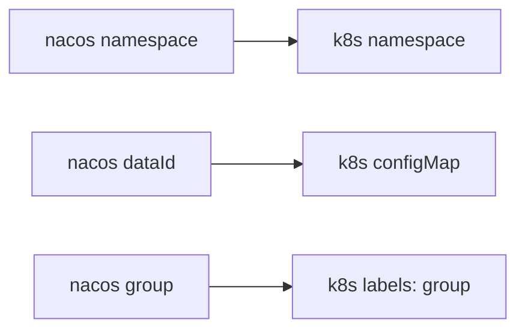

# goconfig

## 用途

将nacos的配置同步到k8s，同步方式为：



## 运行方式

1. 在拥有k8s config（通常在~/.kube/config）的节点已二进制方式运行。命令行参数有

    ```sh
    --autoCreatek8sNs 是否自动创建k8s的namespace
    --configScanTime 扫描nacos上配置的时间间隔，默认10秒
    --logLevel 日志级别，默认info
    --nacosIPs nacos服务器ip地址，以逗号分隔
    --nacosPort nacos服务器端口，默认8848
    --namespaces 要监听的namespace，以逗号分隔
    ```

2. 在k8s中以pod方式运行，命令行参数通过环境变量传入，含义与上面一致；部署时请修改deployment/deployment.yaml

   ```sh
   AUTO_CREATE_K8S_NS
   CONFIG_SCAN_TIME
   LOG_LEVEL
   NACOS_IPS
   NACOS_PORT
   NAMESPACES
   ```
